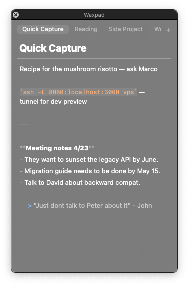

# Waxpad

Waxpad — a floating markdown notepad for macOS. Local .md files, no cloud, no lock-in.



## Features

- Floating HUD window — always on top, stays out of your way
- Markdown live styling (headings, bold, italic, code, links, lists)
- Global hotkey: **Option+N** to toggle the window
- Auto-save to `~/.waxpad-notes/`
- File watcher picks up external edits instantly
- Tabs for multiple notes
- Checkboxes with **Cmd+Enter**
- List continuation (Enter keeps the list going)
- Smart paste — paste a URL with text selected to create a `[link](url)`
- **Cmd+B** bold, **Cmd+I** italic, **Cmd+E** inline code

## Install

### Homebrew (recommended)

```bash
brew tap mchlkucera/tap
brew install waxpad
```

### From source

```bash
# Build release binary
swift build -c release

# Copy to PATH
cp .build/release/Waxpad /usr/local/bin/waxpad
```

Or use the Makefile:

```bash
make install
```

Or build a proper .app bundle (no Dock icon, drag to /Applications):

```bash
./scripts/build-app.sh
# → build/Waxpad.app
```

## Usage

| Shortcut | Action |
|---|---|
| **Option+N** | Toggle Waxpad window (global) |
| **Cmd+N** | New note |
| **Cmd+W** | Close tab |
| **Cmd+B** | Bold |
| **Cmd+I** | Italic |
| **Cmd+E** | Inline code |
| **Cmd+Enter** | Toggle checkbox |
| **Cmd+V** | Smart paste (URL on selection → link) |

## Why

Raycast Notes was great until it wasn't — your notes are locked inside Raycast with no export and no local files. Waxpad stores plain `.md` files in `~/.waxpad-notes/` so you own your data and can open them with any editor.

## License

MIT
